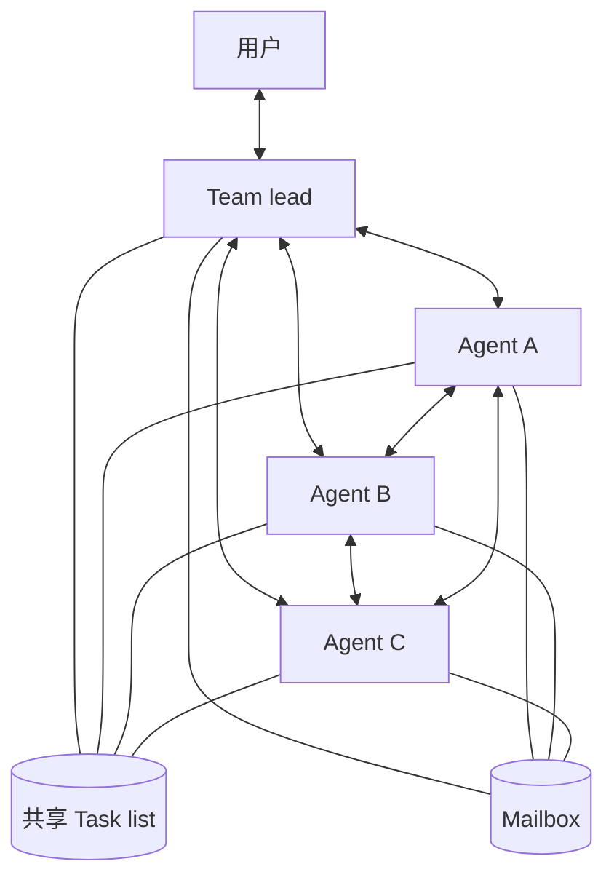
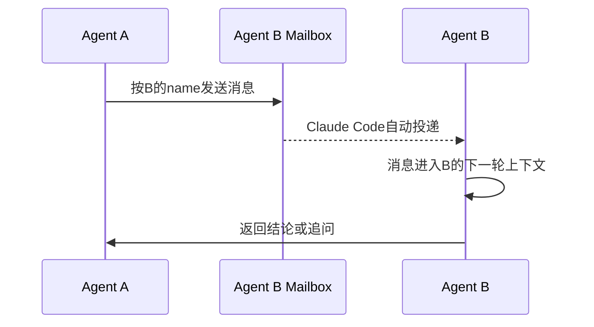

# 背景

前面学习sub agent的时候，主agent可以把一个独立的问题交给新的agent处理，sub agent拥有自己的上下文，处理结束后只把最终结果返回给主agent。

这种设计解决的是**上下文隔离**：主agent不用看到sub agent中间读了什么文件、执行了什么命令、遇到了什么bug，只接收一个压缩后的结果。

但是sub agent更像临时工：

* 只能向主agent汇报，sub agent之间不能直接沟通
* 任务由主agent统一分配，自己不能通过共享任务列表协作
* 完成任务并返回结果后，这个工作关系也就结束了

如果任务需要多个agent互相讨论、质疑结论、接力处理，就需要一套更完整的协作机制。Claude Code中的agent teams就是把多个独立的Claude Code会话组织成一个团队，通过共享任务列表和消息系统来协作。

目前agent teams还是实验性功能，默认关闭。启用方式是在`settings.json`中加入：

```json title="~/.claude/settings.json"
{
  "env": {
    "CLAUDE_CODE_EXPERIMENTAL_AGENT_TEAMS": "1"
  }
}
```

# 一、agent team的整体结构

一个agent team主要由四部分组成：

| 组件        | 作用                                     |
| --------- | -------------------------------------- |
| Team lead | 主会话，创建队友、拆分任务、协调进度、汇总结果                |
| Teammates | 独立的Claude Code会话，各自拥有单独的context window |
| Task list | 所有agent都能看到的共享任务列表                     |
| Mailbox   | agent之间直接传递消息的邮箱系统                     |

整体关系如下：



Team lead并不是把自己的上下文复制三份。每个teammate启动时会像一个普通的新会话一样加载项目上下文，包括`CLAUDE.md`、skills和MCP servers，同时收到lead创建它时给出的prompt；但是**不会继承lead已有的对话历史**。

多agent特点：文件可以共享，任务状态可以共享，消息可以传递，但是上下文本身并不共享。

# 二、为什么不能只靠共享上下文

最简单的多agent可能是把所有人的消息和工具结果都塞进同一个上下文，但这样很快会遇到问题：

1. 每个agent读到大量和自己任务无关的内容
2. 某个agent的失败过程会污染其他agent的判断
3. 上下文增长速度变成多个agent工作量的总和
4. 很难区分一条消息是用户发的、lead发的，还是另一个teammate发的

所以Claude Code采用的是**独立上下文 + 显式通信**。

agent默认只知道自己的任务和项目公共信息。如果A发现了B需要的信息，就给B发一条消息；如果任务状态发生变化，就更新共享task；如果需要用户授权，就通过lead把权限请求交给用户。

这种设计有点像进程间通信：每个进程有自己的内存，通过共享状态和消息队列交换必要的信息。

# 三、Task list：用共享状态协调工作

只有消息还不够。假设lead告诉三个agent分别完成数据库、接口和测试，如果全部依赖口头消息来维护进度，agent很容易重复工作，或者在前置任务没有完成时提前开始。

因此agent teams复用了task系统作为团队的公共任务面板。一个task主要包含：

```python
class Task:
    id: str
    subject: str
    description: str
    status: str       # pending | in_progress | completed
    owner: str | None # 当前由哪个agent处理
    blockedBy: list[str]
```

task有三种状态：

* `pending`：等待认领或等待前置任务完成
* `in_progress`：已经被某个agent认领
* `completed`：任务已经完成

lead可以直接指定某个任务由谁处理，teammate也可以在完成手上的工作后，自行认领下一个没有owner并且未被阻塞的任务。

认领任务时需要处理竞态问题：如果A和B同时看到task 3是`pending`，不能让两个人都认为自己认领成功。Claude Code使用**文件锁**来保证同一个任务只会被一个agent认领。

依赖关系则用于控制执行顺序：

当A完成“设计数据库结构”后，B和C自动解除阻塞；当B、C都完成后，D才可以被认领。

所以task list承担的不是聊天，而是团队的**公共事实**：谁在做什么、做到哪一步、下一个任务能不能开始。

# 四、Mailbox：agent之间如何直接通信

task适合保存结构化状态，但不适合装调查结论、接口约定、反驳意见等内容，这些信息通过mailbox传递。

当前官方文档中，每个agent都有一个本地邮箱文件：

```text
~/.claude/teams/{team-name}/inboxes/{agent-name}.json
```

团队运行时的配置保存在：

```text
~/.claude/teams/{team-name}/config.json
```

共享任务保存在：

```text
~/.claude/tasks/{team-name}/
```

`config.json`中会记录团队成员的name、agent id和agent type，teammate可以通过它发现团队中还有哪些成员。它还包含会话id、tmux pane id等运行时状态，所以不应该手动修改；下一次状态更新也可能覆盖人工修改。

消息的基本流程可以理解为：



消息发出后会自动投递，lead不需要不断询问“有没有新消息”。teammate结束一轮工作进入空闲状态时，也会自动通知lead；如果因为API错误失败，新版本会把失败信息和错误文本一起通知lead。

消息可以发给某一个明确的teammate。所谓“通知所有人”，底层仍然是给每个收件人各发一条消息，并不是所有agent共享一个公共聊天窗口。

# 五、通信不是只有文本，还需要协议

普通发现可以直接发送文本：

```text
auth接口最终使用httpOnly cookie保存JWT，测试时不要从localStorage读取token。
```

但是有些交互不能只靠一句自然语言，因为它们需要明确的请求方、接收方、状态和回复关系，例如：

* teammate请求执行需要用户授权的命令
* teammate提交plan，请lead批准后再修改代码
* lead请求某个teammate关闭

这类消息可以抽象成一个协议状态：

```python
@dataclass
class ProtocolState:
    request_id: str
    type: str          # permission | plan_approval | shutdown
    sender: str
    target: str
    status: str        # pending | approved | rejected
    payload: str
    created_at: float
```

`request_id`是关键。收到`approved`不能只看消息文本，还要知道它批准的是哪一次请求。发送端保存pending request，接收端根据type把消息分发到对应处理逻辑，回复到达后再用request id匹配原请求。

可以把完整流程理解为：

```text
创建请求 -> 写入接收方邮箱 -> 接收方按type路由
        -> 执行/审批 -> 携带request_id回复 -> 原请求结束
```

具体内部函数名和轮询间隔可能随Claude Code版本变化，但是“请求状态 + 消息分发 + 响应匹配”是这类交互能够可靠工作的核心。


# 六、空闲、唤醒和继续工作

多个agent并行时，不应该让lead手动询问每个人是否完成。teammate完成当前工作后会进入idle，并通知lead；如果共享task list中还有可以认领的任务，它可以继续认领工作。

idle并不等于teammate已经销毁。in-process界面中，空闲agent的行可能在一段时间后隐藏，但是会话仍然存在，也仍然可以按name发送消息；收到新消息或者新任务后，它会重新开始下一轮。

因此一个teammate的生命周期大致是：

```text
启动 -> 接收初始prompt -> 认领task -> 工作
  -> 更新task/发送结果 -> idle
  -> 收到消息或认领新task -> 再次工作
  -> 收到shutdown request -> 同意后退出
```

如果lead希望结束某个teammate，会发送shutdown request。teammate可以完成当前操作后同意关闭，也可以拒绝并说明原因。这同样是一次有请求和响应的握手，而不是直接把线程杀掉。


# 七、sub agent和agent team

| 对比 | Sub agent | Agent team |
| --- | --- | --- |
| context | 独立context，结果返回调用者 | 每个teammate都是完全独立的会话 |
| 通信 | 只能向主agent返回结果 | teammate可以按name直接互相通信 |
| 协调 | 主agent统一分配 | 共享task list，可以自我认领 |
| 生命周期 | 完成一次委派后结束 | 可以idle、被唤醒、继续认领任务 |
| 成本 | 相对较低 | 每个teammate独立消耗token，成本更高 |
| 适用任务 | 只关心最终结果的独立任务 | 需要讨论、反驳、接力和跨模块协作的任务 |

判断标准不是“任务大就一定使用team”，而是**agent之间是否真的需要交流**。

例如让一个agent查文档、另一个agent跑测试，最后只需要把两个结果交给主agent，sub agent就够了。如果安全agent需要不断审查接口agent的方案，前端和后端需要协商接口，多个调查者需要互相反驳假设，agent team才更合适。

# 八、一个适合agent team的例子

比如排查“客户端发送一条消息后进程直接退出”的问题。单agent很容易找到第一个看起来合理的解释后停止搜索，可以让多个agent分别维护竞争假设：

```text
创建4个teammate调查程序发送一条消息后退出的问题：

1. network：检查连接和心跳
2. lifecycle：检查进程生命周期和异常退出
3. protocol：检查消息协议和服务端响应
4. reviewer：汇总证据，并主动反驳前三个agent的结论

让前三个agent把证据直接发给reviewer；
reviewer发现证据不足时直接追问对应agent；
最后由lead汇总已经被交叉验证的结论。
```

在这个流程中：

* task list保存四个人的任务和完成状态
* mailbox传递日志位置、代码引用和反驳意见
* reviewer与其他agent直接进行多轮交互
* lead负责确保所有任务完成，并综合最终答案

多agent带来的价值不只是并行速度，还包括用不同上下文形成相对独立的假设，再通过通信互相证伪，降低单个agent过早收敛的风险。


# 总结

Claude Code的多agent不是简单地多开几个窗口，而是在多个独立上下文之上增加了两条协作通道：

* **Task list负责共享状态**：任务是什么、归谁、是否完成、被什么阻塞
* **Mailbox负责传递信息**：发现、反馈、追问以及协议请求

普通内容通过消息直接传递；权限审批、plan approval、shutdown这类有状态操作，则需要request id、状态、分发和响应匹配来完成一次可靠握手。

所以agent teams解决的核心问题不是“怎么同时调用多个模型”，而是：**一群上下文相互隔离的agent，怎样在不共享全部思考过程的情况下，仍然能看到同一份任务事实、把必要信息准确地交给对方，并在需要时让用户介入。**


